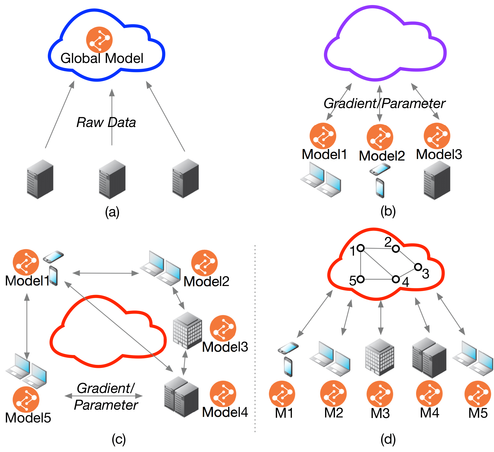
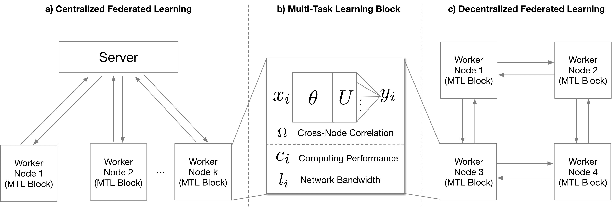
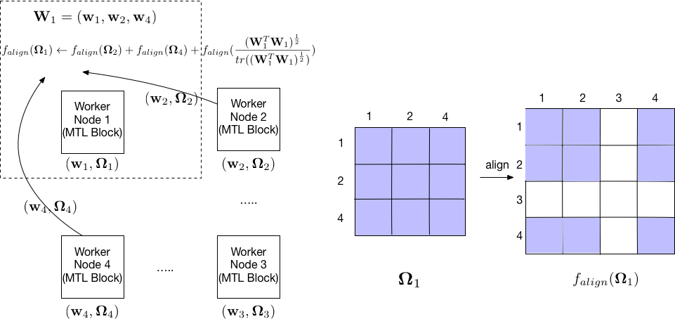
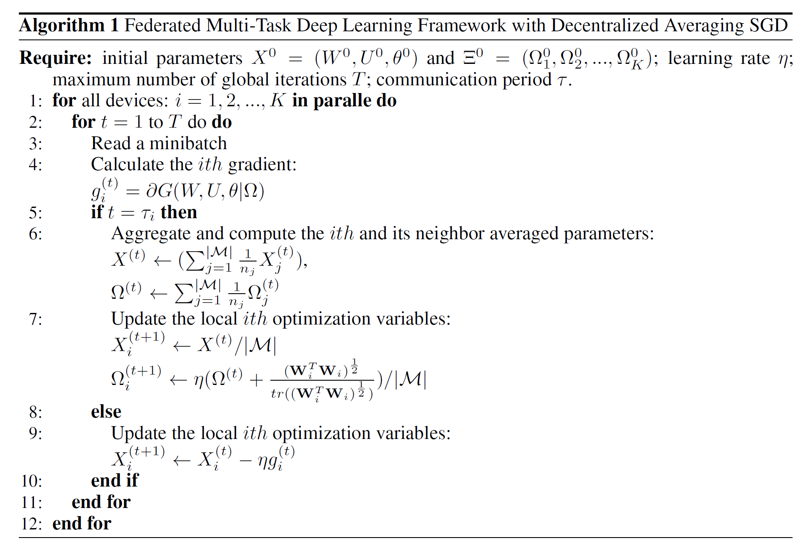
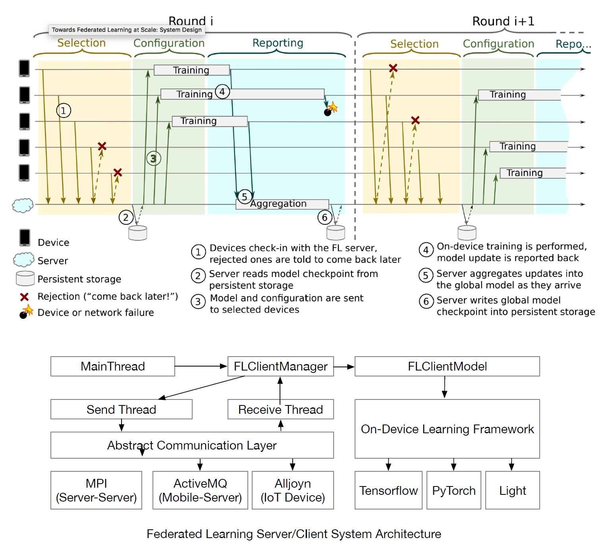
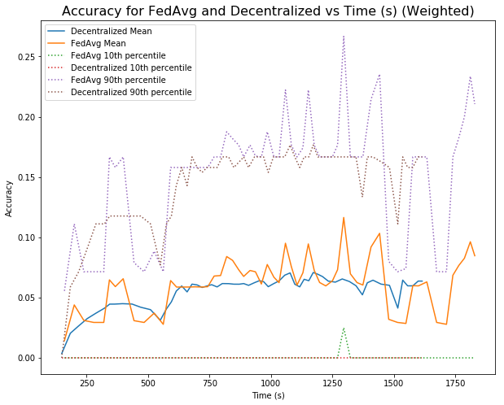
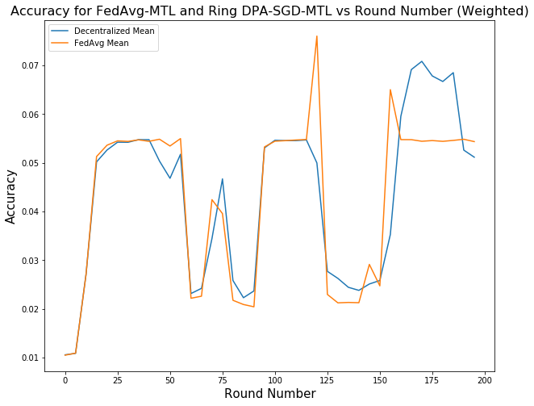
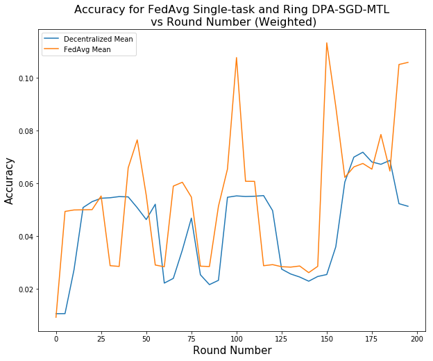
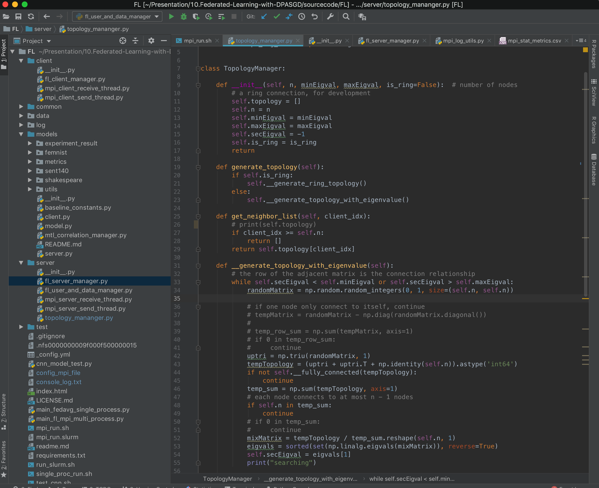
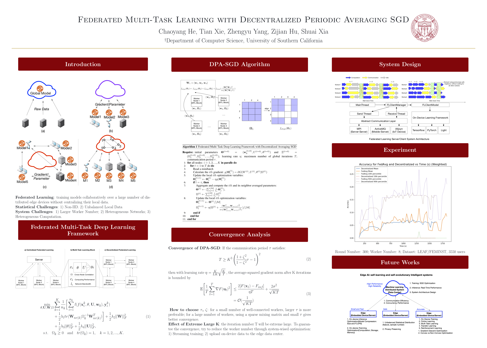

In the cloud-based environment, distributed deep learning systems such as Tensorflow and PyTorch is widespread in various domains, but they are typically built based on the parameter server, which
requires data integrated into one place (a server or a cluster) to train a model\[Dean *et al.*; Li *et al.*, 2014; Cui *et al.*, 2014; Abadi *et al.*, 2016; Paszke *et al.*, 2017\], as shown in Figure 1(a). Increasing
practical constraints lead this data integration difficult or impossible, including data privacy and confidentiality, intellectual property protection, and law constraints. A promising solution to these
problems is called Federated Learning \[McMahan *et al.*, 2016\]. As shown in Figure 1(b), Federated Learning enables collaboratively training on edge devices or edge data centers through exchanging parameters or gradients without centralizing their scattered data (In this work, we use both worker and node to represent edge devices or edge data centers). Representative examples happen in various domains such as Mobile Internet, health, and finance domains \[McMahan and Ramage, 2017, Liu *et al.*, 2018a, Liu *et al.*, 2018b\].



## Problem formulation


### Statistical Challenges
1. **Non-IID**: Each worker generates data in a non-i.i.d. (independent and identically distributed) manner with a distinct statistical distribution.
1. **Unbalanced Local Data**: Workers have different quantity of data sample due to their different behaviors.

These two characteristics bring challenges to learning a high-performance personalized model for each worker.

### System Challenges
1. **Larger Worker Number**: The worker number is typically larger than cloudbased learning. The larger number will pose a higher communication cost and difficult communication
synchronization.
1. **Heterogeneous Networks**: Each worker may differ in communication capacity due to heterogeneous networks(4G, WiFi, and other IoT protocol).
1. **Heterogeneous Computation**: Computational
capacities of each worker may differ due to variability in hardware(CPU, memory).

These three characteristics make communication cost and low-speed training become a major bottleneck towards real-world deployment.


In practice, scattered data owners also demand personalized models rather than a global model for all owners. They hope to not only get help from other owners’ data to train a high accuracy model but also to gain their personalized models which can represent their unique data properties. Thus, to simultaneously address statistical and system challenges is the primary research direction of federated learning.



### General Definition of Federated Learning

Following the first federated learning paper McMahan *et al.* \[2016\], we define the objective function for the federated setting as

```latex
\begin{aligned}
F(\textbf{w}) &= \sum_{k=1}^{K} \frac{n_k}{N} F_{k}(\textbf{w}) \\
&= \sum_{k=1}^{K} \frac{n_k}{N} \frac{1}{n_k} \sum_{i \in \mathcal{P}_{k}} l(\textbf{x}_{i}, \textbf{y}_{i}; \textbf{w})
\end{aligned}
```

where $ l(\textbf{x}\_{i}, \textbf{y}\_{i}; \textbf{w}) $ is the loss function of the prediction on example $(\textbf{x}\_{i}, \textbf{y}\_{i})$ made with model parameters $\textbf{w}$, K is the total learning nodes number, $\mathcal{P}\_{k}$ is the set of indexes of data points on node k, $n_k = |P_k|$, and $\sum_{k=1}^{K} n_{k} = N$. This objective function can capture the different quantity of samples and statistical distribution of K nodes. Here, different nodes learn the global model jointly, which showing as the same loss function $l$ and parameters $\textbf{w}$.


### General Framework of Federated Multi-Task Learning

As mentioned in the introduction, federated multi-task learning is a framework that can improve the performance by directly capturing the relationships among unbalanced data in multiple devices, which implies that it can address the statistical challenges in federated learning. The general formulation for federated multi-task learning is:

```latex
\min_{\textbf{W}}\sum_{k=1}^{K}\frac{1}{n_k}\sum_{i=1}^{n_k}l_i(\textbf{x}_i,\textbf{y}_i;\textbf{w}_k) + \mathcal{R}(\textbf{W},\bm{\Omega}).
```

where $\textbf{W} = (\textbf{w}\_1,\textbf{w}\_2,...,\textbf{w}\_K) \in \mathbb{R}^{d \times{m}}$ is the parameters for different tasks and $\mathcal{R}(\textbf{W},\bm{\Omega})$ is the regularization. Different multi-task framework is mainly different from the regularization term $\mathcal{R}$.

The first term of the objective models the summation of different empirical loss of each node. The second term serves as a task-relationship regularizer with $\bm{\Omega}\in\mathbb{R}^{K\times{K}}$ being the covariance matrix Zhang and Yeung \[2012\].

The covariance matrix is able to describe positive, negative and unrelated correlation between nodes, which can either known as priori or being measured while learning the models simultaneously.

Each element $\bm{\Omega}\_{i,j}$ is a value that indicates the similarity between two nodes. Here we use a bio-convex formulation in Zhang and Yeung \[2012\], which is a general case for other regularization methods,


```latex
\mathcal{R}(\textbf{W},\bm{\Omega}) = \lambda_ 1tr(\textbf{W}\bm{\Omega}^{-1}\textbf{W}^{T}) + \lambda_2||\textbf{W}||_F^2.
```

where we constrain $\vec{W}$ with covariance matrix $\bm{\Omega}^{-1}$ through matrix trace $tr(\bm{W}\bm{\Omega}^{-1}\textbf{W}^{T})$. This means the closer $\textbf{w}_i$ and $\textbf{w}_j$ is, the larger the $\bm{\Omega}\_{i,j}$ will be. Specifically if $\bm{\Omega}$ is an identity matrix, then each node is independent to each other.
Smith *et al.* \[2017\] proposed MOCHA based on the above multi-task learning framework. However, MOCHA can only handle convex functions in federated multi-task learning settings, which can not be generated to non-convex deep learning models. Our work generates federated multi-task learning framework to the non-convex DNN setting.


### Federated Multi-Task Deep Learning Framework

DNNs are able to extract deep features from raw data. However, to the best of our knowledge, DNNs has not been applied to federated multi-task problems. We thus consider DNNs as our feature transformation function and make prediction based on the hidden features. Formally speaking, the formulation can be defined as:

```latex
\begin{aligned}
& \begin{aligned} \min_{\bm{\theta}, \vec{U},\vec{W},\bm{\Omega}}
&\sum_{k=1}^{K}\frac{1}{n_k}\bigg[\bigg.\sum_{i=1}^{n_k}l(f(\vec{x}_i^{k},\bm{\theta}_k,\vec{U}_k,\vec{w}_k),\vec{y}_i^k) \\
&+ \frac{1}{2}\lambda_ 1tr(\vec{W}_k\bm{\Omega}_k^{-1}\vec{W}_k^{T})\bigg]\bigg. + \frac{1}{2}\lambda_2||\vec{W}||_F^2\\
&+\frac{1}{2}\lambda_3||\bm{\theta}||_F^2 + \frac{1}{2}\lambda_4||\vec{U}||_F^2, \end{aligned} \\
& \quad \text{s.t.} \quad  \bm{\Omega}_k \ge 0 \quad \text{and} \quad tr(\bm{\Omega}_k) = 1, \quad k = 1, 2, ... ,K.
\end{aligned}
```

where $f(\cdot)$ represents DNNs feature mapping as shown in Figure 2(b). $\bm{\theta}\_k$ is the feature transformation network. $\bm{U}\_k$ and $\vec{w}\_k$ are output layer (e.g. softmax). The first constraint holds due to the fact that $\bm\Omega$ is defined as a task covariance matrix. The second constraint is used to restrict its complexity.

In federated learning situation, training should be conducted on each node respectively. One intuitive thought is the centralized network topology in McMahan *et al.* \[2016\], where one center node synchronously takes a weighted average parameters of every clients at each time step (Figure 2(a)). However,  this model faces the problems that in DNNs situation, far more parameters need to be calculated and transferred. Each node has heterogeneous computing performance and network bandwidth (Figure (b))). Setting one center node to synchronously collect all the parameters will induce high communication cost and low convergence speed. In order to overcome these problems, we design a decentralized topology, where each node only needs to share their parameters with neighbored nodes as shown in Figure 2(c)), where there is no communication between worker one and worker 4. Abandoning the central node induces the problem that parameters cannot be exchanged and synchronized amongst every nodes, which means that the centralized optimization method can not be achieved on this topology. To this end, we propose a Decentralized Periodic Averaging SGD (DPA-SGD) to tackle the optimization problem in decentralized topology.

---

## Approach

### Decentralized Periodic Averaging SGD

As for decentralized topology, due to the disappearing of central node, same central averaging method can not be applied. In order to overcome this problem, we come up with a novel optimization method, Decentralized Periodic Averaging SGD (DPA-SGD). The main idea of DPA-SGD is that during the communication period $\tau$, local SGD is applied on each node respectively, and synchronizing all the parameters at every $\tau$ iterations amongst its connected neighbors. Due to this decentralized diverse connection, one global $\bm\Omega$ can not represent the individual correlation. So we propose to use a distinct covariance matrix $\bm{\Omega}\_k$ to represent their own mutual relationship. We also come up with an effective way to update the different $\bm\Omega_k$. To be specific, consider one particular node $m$ and its neighbor connected nodes as set $\mathcal{M}$.


The new objective function can be defined as:

```latex
\begin{aligned}
& \begin{aligned} \min_{\bm{\theta}, \vec{U},\vec{W},\bm{\Omega}}
&\sum_{k=1}^{K}\frac{1}{n_k}\bigg[\bigg.\sum_{i=1}^{n_k}l(f(\vec{x}_i^{k},\bm{\theta}_k,\vec{U}_k,\vec{w}_k),\vec{y}_i^k) \\
&+ \frac{1}{2}\lambda_ 1tr(\vec{W}_k\bm{\Omega}_k^{-1}\vec{W}_k^{T})\bigg]\bigg. + \frac{1}{2}\lambda_2||\vec{W}||_F^2\\
&+\frac{1}{2}\lambda_3||\bm{\theta}||_F^2 + \frac{1}{2}\lambda_4||\vec{U}||_F^2, \end{aligned} \\
& \quad \text{s.t.} \quad  \bm{\Omega}_k \ge 0 \quad \text{and} \quad tr(\bm{\Omega}_k) = 1, \quad k = 1, 2, ... ,K.
\end{aligned}
```


where $\vec{W}\_k = (\vec{w}\_1,\vec{w}\_2,...,\vec{w}\_m,...\vec{w}\_{|\mathcal{M}|})\in\mathbb{R}^{d\times|\mathcal{M}|}$ is the parameters for $m$ and its neighbor tasks. The matrix $\bm{\Omega}\_k\in\mathbb{R}^{|\mathcal{M}|\times{|\mathcal{M}|}}$ represents the correlation amongst nodes in set $\mathcal{M}$. Here in order to record the entire nodes connection in the network, we introduce a *node connection matrix* $\vec{M}\in\mathbb{R}^{K\times{K}}$ represents the neighbor relationships for each nodes, where $M_{i, j}$ is a value that indicates node $i$ and $j$ are connected as shown in Figure 3, where worker one is only connected with worker two and four. Note that, if $\vec{M} = \vec{I}$ (Identity matrix), then every nodes are independent and update the parameters respectively. If $\vec{M} = \vec{J}$ (one for each element), the model is degenerated into centralized model. We study the model performance under sparse matrix $\vec{M}$ and find that similar results can be achieved as a ring network topology, which each node is only connected with its nearby two nodes, as illustrated in Figure 3.



To solve this non-convex problem, we apply the alternating optimization method  Zhang and Yeung \[2012\], where alternately updating parameters $\vec{X} = (\vec{W, U},\bm{\theta})$ and $\bm\Omega$.

*Optimizing* $\bm\theta, \vec{W}$ and $\vec{U}$: For simplicity, we define set $\Xi = (\bm\Omega_1, \bm\Omega_2,...,\bm\Omega_K)$ to represent the correlation matrix for every nodes. Fixing $\Xi$, we can use SGD method to update $\bm\theta, \vec{W}$ and $\vec{U}$ jointly. Our problem can then be reformulated as:

```latex
 G(\vec{W}, \vec{U}, \bm\theta|\Xi) = \sum_{k=1}^{K}\frac{1}{n_k} \bigg[\bigg. \sum_{i=1}^{n_k}l(f(\textbf{x}_i^{k},\bm{\theta}_k,\textbf{U}_k,\textbf{w}_k),\textbf{y}_i^k)\\ + \frac{1}{2}\lambda_1tr(\textbf{W}_k\bm{\Omega}_k^{-1}\textbf{W}_k^{T})\bigg]\bigg.+ \frac{1}{2}\lambda_2||\textbf{W}||_F^2\\
+ \frac{1}{2}\lambda_3||\bm{\theta}||_F^2 + \frac{1}{2}\lambda_4||\textbf{U}||_F^2
```

We can calculate the gradient of $\vec{W}$, $\vec{U}$ and $\bm\theta$ respectively. Let $L = \sum_{k=1}^{K}\frac{1}{n_k}\sum_{i=1}^{n_k}l(f(\bm{x}\_i^{k}, \bm{\theta}\_k,\bm{u}\_k,\bm{w}\_k),\bm{y}\_i^k)$. Then the gradient formulations for each node are:

```latex
\frac{\partial{G(\vec{W}, \vec{U}, \bm\theta|\Xi)}}{\partial{\vec{w}_k}} = \frac{\partial{L}}{\partial{\vec{w}_k}} + \lambda_1\sum_{i=1}^{\mathcal{|M|}}\frac{1}{n_i}{\vec{w}_k}\bm\Omega_i^{-1}+ \lambda_2\vec{w}_k
```
where the summation is amongst all the nodes connected to node $k$,

```latex
\frac{\partial{G(\vec{W}, \vec{U}, \bm\theta|\Xi)}}{\partial \bm\theta_k} = \frac{\partial{L}}{\partial\bm\theta_k} + \lambda_3\bm\theta_k,
```

```latex
\frac{\partial{G(\vec{W}, \vec{U}, \bm\theta|\Xi)}}{\partial{\vec{u}_k}} = \frac{\partial{L}}{\partial{\vec{u}_k}} + \lambda_4\vec{u}_k
```

*Optimizing* $\Xi$: In paper Zhang and Yeung \[2012\], an analytical solution form is given for $\bm\Omega$:

```latex
\bm\Omega = \frac{(\vec{W}^T\vec{W})^\frac{1}{2}}{tr((\vec{W}^T\vec{W})^{\frac{1}{2}})}
```

Apparently, if $\bm{w}\_i$ and $\bm{w}\_j$ are close to each other, $\bm{\Omega}$ will be large. However, the missing central node forbidding to average parameters globally. So here we propose a novel way to update each $\bm\Omega_k\in\Xi$:

```latex
\bm\Omega_{t+1}^{(k)} \leftarrow \eta\frac{1}{|\mathcal{M}|}({\sum_{i=1}^{|\mathcal{M}|}}\frac{1}{n_i}\bm\Omega_{t}^{(i)} + \frac{(\vec{W}_k^T\vec{W}_k)^\frac{1}{2}}{tr((\vec{W}_k^T\vec{W}_k)^{\frac{1}{2}})})
```

The first averaging term can incorporate the nearby nodes correlation into its own and the second term captures the new correlation between its neighbors as shown in Figure 3.


### Algorithm

In general, the algorithm of DPA-SGD can be summarized as: while in local update period, each node calculates the gradient $g(\vec{X}\_t^{(i)})$ based on one mini-batch of data and then update $\vec{X}^{(i)}$; For every synchronization per $\tau$ update, the novel update way of $\bm\Omega$ is conducted.



### Advantages of Our Algorithm

Here we illustrate system-wise advantages of DPA-SGD:


**Faster convergence speed**. Figure 4 illustrates three reasons that DHA-SGD can speed up convergence.
1. *Periodic averaging* can alleviate the communication delay by reducing times of synchronization which only happen periodically. As we can see in Figure 4, the yellow blocks (communication) will largely be deleted due to the periodic averaging mechanism.
1. This idle time can also be significantly reduced through periodic averaging as shown in Figure 4.
1. In the decentralized topology, because a worker only needs to exchange gradients with its neighbors, another worker with slow computation and communication will not interrupt its iteration. For example, worker 2 in the above figure can synchronize earlier without waiting for worker 4. Thus, DHA-SGD can largely reduce convergence time.

**Fewer communication rounds**. The periodic averaging strategy can reduce the number of communication rounds. Although our work focuses on optimizing the ratio of computation and communication rather than improving the communication cost for each iteration, gradient compression method (Deep Gradient Compression \[Lin *et al.*, 2017\]) for each iteration can directly extendable to to our algorithm in a practical system.


### System Design



We have developed a real-world decentralized federated learning system. Our system is currently deployed in a cluster environment, consisting of 24 physical machines, each supporting 48 CPU cores. Suppose we run one process per CPU core, this system can run up to 1152 workers for parallel training. Our federated learning system enables centralized and decentralization training while supporting the Federated multi-task learning framework. It also supports user and training management in the Federated Learning scenario. As shown in Figure 5 (Upper), it includes training process management such as topology generation, user selection, configuration dispatching, on-device training, and statistics collection. In the topological generation step, we can select the appropriate eigenvalues for the topology matrix according to our the convergence property analysis, which determines the sparseness of the network topology to balance the model accuracy and the training speed. The user selection process can configure different strategies to select distinct users. Each user only requires training once for a model. In our experiment, users are selected according to the LEAF data set. This process can be further optimized in the future to choose users who are more meaningful to the model.

The software architecture of each worker is shown in Figure 5 (Lower). Each work can be an IoT device, smartphone or the edge server.  It is an abstract architecture design for the on-device software system which unifies the system architecture for different on-device operating systems such as Android or iOS for the smartphone and the linux edge server. For the edge server, we implement this system design in a Python environment. For the smartphone, we develop the training worker system based on Android and iOS. The low-level communication is an abstract layer. In the edge server environment, we use the MPI protocol for exchanging gradient or other necessary information. As we can see, the communication sending and receiving threads are independent of the training threads. The collaborate through message queues. Currently, we only disclose the implementation of the MPI communication protocol in the source code. In the future, we consider open source our code to support more on-device platforms.

To put it simply, another contribution of this paper is that we publish a practical federated learning system that can promote further research on distributed learning and especially federated learning. Our code is published at [https://github.com/chaoyanghe/FederatedLearning](https://github.com/chaoyanghe/FederatedLearning).


## Comparison to Previous Works

### Federated Multi-Task Learning

Early examples of research into federated learning. To address both statistical and system challenges, \[Smith *et al.*, 2017\] and \[Caldas *et al*. 2018\] propose a multi-task learning framework for federated learning and its related optimization algorithm, which extends early works from distributed machine learning, including SDCAShalev-Shwartz and Zhang \[2013\]; Yang \[2013\]; Yang *et al.* \[2013\] and COCOAJaggi *et al.* \[2014\]; Ma *et al.* \[2015\]; Smith *et al.* \[2016\]. The main limitation of Smith *et al.* \[2017\] and Caldas *et al.* \[2018\], however, is that **strong duality is only guaranteed when the objective function is convex, which can not be generalized to the non-convex setting, especially deep neural networks**.

Another line of work related to federated multi-task learning is the cloud-based distributed multi-task learning \[Ahmed *et al.*, 2014; Jin *et al.*, 2015; Mateos-Núñez *et al.*, 2015; Wang *et al.*, 2016; Baytas *et al.*, 2016; Liu *et al.*, 2017\]. However, **their assumption that the same amount of work is done locally on each node is prohibitive in federated settings**, and none of these works take into account the systems challenges that arise in the federated setting.

In our work, we focus on training the deep learning model in the federated setting. To be more specific, **in this work we further extend previous works to a generic multi-task deep learning framework and a more efficient optimization method. Different from previous works, we propose a decentralized approach for federated learning**.


### Stochastic Gradient Decent Optimization

In large scale distributed deep learning, to address the communication bottleneck, synchronized mini-batch SGD, which increase the computation to communication ratio, is widely used in the parameter server framework \[Dean *et al.*; Li *et al.*, 2014; Cui *et al.*, 2014\] and popular deep learning systems such as Tensorflow \[Abadi *et al.*, 2016\] and PyTorch \[Paszke *et al.*, 2017\].

Compared to this synchronized mini-batch SGD, Federated Averaging(FedAvg) SGD \[Koneˇcný *et al.*, 2016\] in the federated setting empirically shows it has less communication rounds and it is also robust to non-IID data, which is now the state-of-the-art SGD algorithm for federated learning.

Decentralized SGD, another approach to reducing communication, was successfully applied to deep learning \[Jin *et al.*, 2016; Jiang *et al.*, 2017; Lian *et al.*, 2017\]. Instead of synchronizing with all workers, a worker in the decentralized SGD framework only needs to exchange gradient with its neighbors. Therefore, this sparse-connected topology can reduce the overall communication per iteration.

**Our work aims to design a novel SGD algorithm for our multi-task deep learning framework**, which **can leverage the advantages of periodic averaging SGD and decentralized SGD**. We called it as Decentralized Periodic Averaging SGD. Although recent work \[Wang and Joshi, 2018\] has this idea preliminarily, it does not provide adequate theoretical analysis and empirical evaluation in the federated setting.

## Results

|||
|:---:|:---:|
|||

We compare the performance between FedAvg, the current state-of-the-art Federated Learning algorithm, and our DPA-SGD on Multi-Task Learning Framework (DPA-SGD-MTL) with a ring topology network. From the Figure, we clearly see that the training speed is around 20% faster than the FedAvg. The Ring DPA-SGD-MTL’s accuracy is also comparable to the FedAvg.



We also compared the performance between FedAvg on Multi-Task Learning Framework (FedAvg-MTL) and our DPA-SGD on Multi-Task Learning Framework (Ring DPA-SGD-MTL) with a ring topology network. From the Figure, we clearly see that the training speed is around 20% faster than the FedAvg-MTL. The Ring DPA-SGD-MTL’s accuracy is slightly lower but comparable than the FedAvg-MTL . This proves that our convergence analysis that when decentralized the topology of the gradient exchanging, due to the sparsity of the topology has a negative impact on the convergence of the model. We have to balance the performance of the model and the training speed in the federated learning setting.

We will conduct more experiment on model performance and training speed on communication and computation heterogeneous setting (delay = 0ms, 300ms, 1s, 3s), different number of works (4, 8, 16, 32, 64, 128, 256, 512), and different topologies (0.3, 0.6, 0.9). Hopefully, we can finish these experiments before the NeurIPS deadline.

## Appendix
### Appendix I: Convergence Analysis

**Convergence of DPA-SGD**: If the communication period $\tau$ satisfies:

```latex
T \geq K^{3} \left( \frac{1+\zeta^{2}}{1-\zeta^{2}} \tau - 1 \right)^{2}
```

then with learning rate $\eta = \frac{K}{LK} \sqrt{\frac{K}{T}}$ , the average-squared gradient norm after K iterations is bounded by

```latex
\mathbb{E} \Bigg[ \frac{1}{T} \sum\limits_{t=1}^T {\left\lVert \nabla F(\vec u_{t}) \right\rVert}^{2} \Bigg] \leq \frac{2[F(\vec{x}_{1})-F_{inf}]}{\eta T} + \frac{2\sigma^{2}}{\sqrt{KT}} \\ 
    = \mathcal{O}(\frac{1}{\sqrt{KT}})
```

**How to choose $\tau$, $\zeta$**: for a small number of well-connected workers, larger $\tau$ is more preferable; for a large number of workers, using a sparse mixing matrix and small $\tau$ gives
better convergence.

**Effect of Extreme Large $K$**: the iteration number T will be extreme large. To guaran-tee the convergence, try to reduce the worker number through system-wised optimization:
1. Streaming training
1. upload on-device data to the edge data center.

### Appendix II: Dataset

<table id="leafdata-table"><tr><th><span style="font-weight:bold">Dataset</span></th><th><span style="font-weight:bold">Number of devices</span></th><th><span style="font-weight:bold">Total samples</span></th><th colspan="2"><span style="font-weight:bold">Sample per device</span></th></tr><tr><td></td><td></td><td></td><td>mean</td><td>stdev</td></tr><tr><td>FEMNIST</td><td>3,550</td><td>805,263</td><td>226.83</td><td>88.94</td></tr><tr><td>Sent140</td><td>660,120</td><td>1, 600, 498</td><td>2.42</td><td>4.71</td></tr><tr><td>Shakespeare</td><td>2,288</td><td>106, 126</td><td>46.38</td><td>91.71</td></tr></table>

### Appendix III: Code Snippet


### Appendix IV: Poster
<figure><a href="/attachment/fl-dpa-sgd-poster.pdf"></a><figcaption>Poster (click to see the pdf)</figcaption></figure>

----

# Citations
```
@inproceedings{
  he2019dpasgd,
  title = {Federated Multi-Task Learning with Decentralized Periodic Averaging SGD},
  author = {He, Chaoyang and Xie, Tian and Zhengyu, Yang and Hu, Zijian and Xia, Shuai},
  year = {2019},
  url={https://dpa-sgd.github.io/},
}
```
